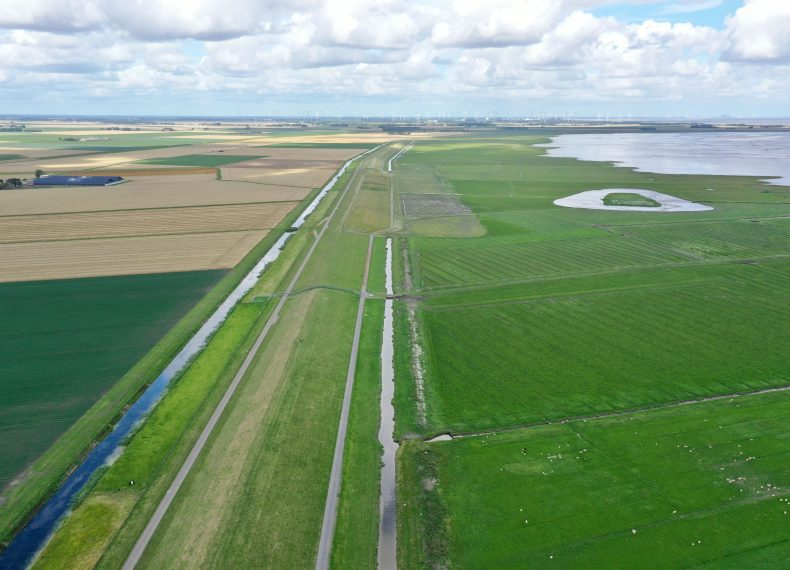

# BredeGroeneDijk
The Wide Green Dike Project

This model was developed by Peter Jansson and colleagues as part of a task to conceptualise an innovative infrastructure renewal process in the Netherlands as a System Dynamics problem, including barriers to upscaling. 

The dashboard can be accessed [here](https://exchange.iseesystems.com/public/maaike-van-aalst/dijken-en-natuur).

Note to self: add data folder with differnt readme and license.

